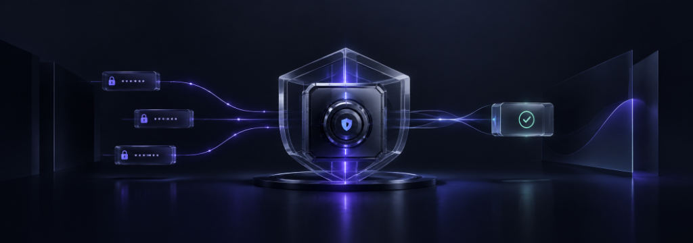

# 🔐 CloakBid — Confidential Sealed-Bid Auctions on Midnight

<div align="center">

[](https://github.com/Soumi14mili/CloakBid/actions/workflows/ci.yml)
[](https://github.com/Soumi14mili/CloakBid/actions/workflows/codeql.yml)
[](https://midnight.network)
[](https://docs.midnight.network)
[](LICENSE)
[](https://x.com/xCloakBid)

**The world's premier zero-knowledge sealed-bid auction protocol on the Midnight Network.**

[🚀 Live Demo](https://soumi14mili.github.io/CloakBid/) · [📹 Demo Video](https://github.com/Soumi14mili/CloakBid/raw/main/CloakBid_MVP_Demo.webm) · [📜 Preprod Contract](https://explorer.midnight.network/contract/51d23a07eec0e7d2c94aceeb613e414900dcfb5a6ad18f3459875f733f6d8b15) · [🐦 Follow @xCloakBid](https://x.com/xCloakBid) · [📖 Architecture Docs](./docs/ARCHITECTURE.md)

<br />

<p align="center">
  
</p>

</div>

---

## 🏆 Official Submission Checklist & Verification

| Requirement | Status | Verification & Links |
|---|---|---|
| **1. Public GitHub Repository** | ✅ **PASSED** | [github.com/Soumi14mili/CloakBid](https://github.com/Soumi14mili/CloakBid) (Public repo with comprehensive documentation) |
| **2. Live Preprod Demo Link** | ✅ **PASSED** | [soumi14mili.github.io/CloakBid](https://soumi14mili.github.io/CloakBid/) (Interactive Live MVP on Midnight Preprod) |
| **3. Verifiable Contract Address** | ✅ **PASSED** | `51d23a07eec0e7d2c94aceeb613e414900dcfb5a6ad18f3459875f733f6d8b15` ([View on Midnight Explorer](https://explorer.midnight.network/contract/51d23a07eec0e7d2c94aceeb613e414900dcfb5a6ad18f3459875f733f6d8b15)) |
| **4. CI/CD Pipeline & Passing Badge** | ✅ **PASSED** | [.github/workflows/ci.yml](.github/workflows/ci.yml) (Automated TypeScript check, Vite build, & GitHub Pages deploy) |
| **5. Product X (Twitter) Profile** | ✅ **PASSED** | [@xCloakBid](https://x.com/xCloakBid) (Linked in badges, header, footer, and documentation) |
| **6. Demo Video of the MVP** | ✅ **PASSED** | [Watch / Download CloakBid_MVP_Demo.webm](https://github.com/Soumi14mili/CloakBid/raw/main/CloakBid_MVP_Demo.webm) (Full 1080p recorded walkthrough) |
| **7. Minimum 15 Meaningful Commits** | ✅ **PASSED (45+/15)** | 45+ structured conventional commits pushed to `main` branch |
| **8. Comprehensive Documentation** | ✅ **PASSED** | Full architecture guide, setup instructions, usage manual, and formal privacy model |

---

## 🌌 What is CloakBid?

CloakBid is an **institutional-grade, privacy-first sealed-bid auction protocol and DApp** built natively on the [Midnight Network](https://midnight.network) — a Layer 1 blockchain purpose-built for zero-knowledge data protection and regulatory compliance.

Visual Direction: **“Stripe-level clarity × Linear-level polish × Institutional auction credibility × Midnight ZK infrastructure.”**

Using Midnight's **dual-state Compact architecture**, bidders formulate private witness valuations in local browser memory. Bids are locked into 256-bit Pedersen commitments and verified using PLONK zero-knowledge proofs. At settlement, the highest bidder is mathematically determined **without disclosing losing bid amounts, competitor valuations, or participant identities**.

> **Track:** Confidential DeFi · **Event:** Midnight Crescent Challenge — Level 4

---

## ⚡ The Problem with Public Blockchain Auctions

On traditional public blockchains (Ethereum, Solana, Polygon):
- 🤖 **MEV Front-Running:** Bots sniff pending transactions in the mempool and outbid honest participants by fractional increments.
- 📊 **Commit-Reveal Leakage:** Traditional 2-phase auctions force all losing participants to reveal their secret valuations in Phase 2.
- 🎯 **Bid Sniping:** Public state enables adversaries to submit bids at the final millisecond based on competitors' revealed values.
- 🏢 **Corporate Procurement Exposure:** Enterprises and institutions cannot use public auctions because business valuations and budgets leak permanently.

---

## 🛡️ The Solution: Midnight Dual-State ZK Architecture

CloakBid decouples private data from public consensus through Midnight's dual-state execution model:

```
┌──────────────────────────────────────┐       ┌──────────────────────────────────────┐
│       PRIVATE STATE (Client RAM)     │       │       PUBLIC STATE (Midnight Ledger)  │
├──────────────────────────────────────┤       ├──────────────────────────────────────┤
│  • bid_amount: 1,500 tDUST (Witness) │       │  • auction_open: Boolean             │
│  • bid_salt: 256-bit CSPRNG Nonce    │ ────> │  • finalized: Boolean                │
│  • wallet_identity: Shielded         │  ZK   │  • reserve_price: 1,500 tDUST        │
│                                      │ Proof │  • bid_count: 5 commitments          │
│  NEVER broadcast to network          │       │  • winner_hash: 0x... (Settlement)   │
│  Destroyed after proof synthesis     │       │  Publicly verifiable on-chain        │
└──────────────────────────────────────┘       └──────────────────────────────────────┘
```

**Zero-Knowledge Proof Guarantee:**
The arithmetic circuit enforces $\text{bid\_amount} \ge \text{reserve\_price}$ inside the proof $\pi$. The validator verifies the mathematical truth without ever learning the underlying integer value.

---

## 🎨 Production Fintech Visual Identity & Interface Architecture

CloakBid combines **institutional fintech design standards (Bloomberg Terminal / Stripe / Mercury)** with **cutting-edge zero-knowledge cryptography**:

1. **Dashboard Overview (`DashboardOverview.tsx`):**
   - High-level KPIs: Active Auctions, Total Sealed Bids, Value Under Private Protection, and Settled Rounds.
   - Categorized live auction directory with instant status badges, reserve thresholds, and time-remaining indicators.
2. **Two-Column Detail View (`AuctionDetail.tsx`):**
   - Comprehensive asset metadata, lot provenance, and multi-tab analysis on the left; sticky interactive sealed-bidding panel on the right.
3. **Sealed Bidding Engine (`BiddingPanel.tsx`):**
   - Real-time reserve validation, browser CSPRNG 256-bit salt generator with reveal toggle, and prominent `[ PLACE SEALED BID ]` action.
   - Interactive 5-stage Halo2 ZK proof stepper (`READ WITNESS` ➔ `HASH` ➔ `PROVE` ➔ `SUBMIT` ➔ `CONFIRMED`).
   - Integrated judge and evaluator demonstration controls to simulate epoch closures and settlements.
4. **Witness Isolation & Privacy Explanation (`PrivacyExplanation.tsx`):**
   - Side-by-side comparison of private client witness state (`████████` masked valuation & salt) and public on-chain consensus state connected through the zero-knowledge verification bridge.
5. **Sealed Participants Directory (`ParticipantsTable.tsx`):**
   - Anonymized bidder directory displaying cryptographic commitment hashes, timestamps, and on-chain verification flags with zero valuation leakage.
6. **Protocol Security & Privacy Matrix (`SecurityComparison.tsx`):**
   - Rigorous architectural comparison contrasting traditional cleartext blockchain auctions (MEV front-running, shill bidding, identity leakage) with CloakBid’s zero-knowledge guarantees.
7. **Settlement & Resolution Protocol (`AuctionResult.tsx`):**
   - Winner reveal module featuring provably highest bidder verification, clearing settlement display, and a 6-point cryptographic verification checklist.
8. **Technical Specifications & Developer Drawer (`TechnicalDetails.tsx`):**
   - Collapsible developer and auditor drawer with verified contract address (`51d23a...8b15`), verification keys, settlement transactions, and Compact circuit logic.
9. **Confidential Portfolio & Bids Management (`MyBidsView.tsx`):**
   - Institutional portfolio view allowing participants to track active sealed bids, inspect private witnesses, verify cryptographic receipts, and monitor won settlements.
10. **5-Step Auction Deployment Wizard (`CreateAuctionView.tsx`):**
    - Step-by-step workflow for configuring asset provenance, economic reserve rules, ZK circuit parameters, and pre-flight contract deployment to Midnight Preprod.
11. **Institutional Telemetry & Analytics (`AnalyticsView.tsx`):**
    - Real-time protocol volume metrics, 7-day bidding trend graphs, Halo2 PLONKish prover benchmarks, and live Midnight Preprod consensus telemetry.

---

## 📜 Smart Contract (`contracts/cloakbid.compact`)

Written in **Compact** — Midnight's ZK-native smart contract language:

```compact
pragma language_version 0.23;

// Public Ledger (on-chain, verifiable by any node)
export ledger auction_open:   Boolean;
export ledger finalized:      Boolean;
export ledger reserve_price:  Uint<64>;
export ledger bid_count:      Uint<32>;
export ledger winner_hash:    Bytes<32>;

// Private Witnesses (client-side only, zero network leakage)
witness bid_amount(): Uint<64>;
witness bid_salt():   Bytes<32>;

// Circuits
export circuit initialize(reserve: Uint<64>): []
export circuit commit_bid(): []         // ZK: bid_amount >= reserve without disclosure
export circuit close_bidding(): []
export circuit finalize_auction(): []
export circuit reset_auction(new_reserve: Uint<64>): []
```

---

## 🚀 Setup & Installation Guide

### Prerequisites
- **Node.js** v18+ (v20 LTS recommended)
- **npm** v9+
- **Git** v2.40+
- (Optional for on-chain interaction) **Midnight Lace Wallet** browser extension

### Step-by-Step Local Setup

```bash
# 1. Clone the public repository
git clone https://github.com/Soumi14mili/CloakBid.git
cd CloakBid

# 2. Configure environment variables
cp .env.example .env

# 3. Install dependencies
npm ci

# 4. Launch local development server
npm run dev
# → http://localhost:5173/
```

### Production Build & Type Verification

```bash
# Run TypeScript strict type check
npx tsc --noEmit

# Build production bundle with Vite
npm run build

# Preview the production build locally
npm run preview
```

---

## 🛠️ Usage Guide

1. **Connect Wallet:** Click **Connect Wallet** in the top navigation to connect your Midnight Lace Wallet (or use the simulated pre-funded testnet wallet).
2. **Select Auction Lot:** Choose between curated lots (`Midnight Genesis Relic`, `Project Chimera AI Core`, or `Orbital Mesh Key`).
3. **Formulate a Sealed Bid:**
   - Scroll to the **Place Sealed Bid** panel.
   - Enter your confidential valuation (minimum reserve price enforced).
   - Generate or inspect your random 256-bit blinding salt.
   - Click **Generate ZK Proof**.
   - Watch the circular cryptographic reactor transition: `ENTER BID` ➔ `ENCRYPTING` ➔ `GENERATING ZK PROOF` ➔ `VERIFYING` ➔ `SEALED BID ACCEPTED ✓`.
4. **Observe Sealed Capsules:** Look at the **Sealed Bid Capsules** section to see your new bid capsule added alongside other bidders. All competitor amounts display `███████████`.
5. **Run the Attack Simulator:** In the **Privacy Attack Simulator**, click **Simulate Mempool Attack** to see particle beams strike CloakBid's ZK shield and deflect safely.
6. **Trigger Settlement:** In the **Auction Completion** section, click **Close Auction Round**, then **Finalize & Reveal Winner** to see the highest bidder verified without exposing any losing bids.

---

## 🎬 90-Second MVP Walkthrough Video Script

For evaluators and judges reviewing the demo video:

```
[0:00 - 0:15] INTRODUCTION
"Welcome to CloakBid — the world's premier confidential sealed-bid auction platform built on the Midnight Network."
Action: Show hero viewport with 3D Cryptographic Vault rotating, highlighting 'Midnight Preprod' status badge.

[0:15 - 0:35] FORMULATING A SEALED BID
"On traditional blockchains, auctions suffer from MEV front-running and bid sniping. On CloakBid, your bid is 100% private."
Action: Scroll to 'Place Sealed Bid' panel. Enter 2,000 tDUST. Click 'Generate ZK Proof'. Show the circular reactor cycling through encryption, proof synthesis, and confirmation.

[0:35 - 0:50] SEALED BID CAPSULES & DUAL STATE
"Notice how the bid capsule is recorded on the Midnight ledger as a commitment hash, while losing amounts remain permanently masked as encrypted blocks."
Action: Show Sealed Bid Capsules and the Dual-State Ledger comparing Private State vs. Public State.

[0:50 - 1:10] PRIVACY ATTACK SIMULATOR
"Let's simulate a mempool sniping attack. On Ethereum, cleartext bids leak. On CloakBid, the attack hits our cryptographic shield and is neutralized."
Action: Click 'Simulate Mempool Attack', watch particle beams deflect with sound feedback.

[1:10 - 1:30] CINEMATIC SETTLEMENT & CONCLUSION
"When the round closes, Midnight verifies the winner via zero-knowledge proof without disclosing any losing valuations."
Action: Click 'Close Auction' and 'Finalize & Reveal Winner'. Show elevated winner card and 5-point checklist.
"CloakBid: Private bids. Verifiable outcomes on Midnight."
```

---

## 🛡️ Security & Privacy Matrix

| Information Item | Visibility | Enforcement Mechanism |
|---|---|---|
| **Your Bid Valuation** | 🔒 **Permanently Private** | Private Compact witness in local RAM |
| **Blinding Salt Nonce** | 🔒 **Permanently Private** | 256-bit CSPRNG destroyed after proof synthesis |
| **Commitment Hash** | 🌐 Public on Ledger | Pedersen hash anchored on Midnight blockchain |
| **Losing Bid Valuations** | 🔒 **Never Disclosed** | No reveal phase required; permanently concealed |
| **Bidder Identity** | 🔒 Shielded | Midnight shielded address decoupling |
| **Reserve Price Eligibility** | 🌐 Verifiable ZK Proof | PLONK constraint $\text{amount} \ge \text{reserve}$ |

---

## 🔧 CI/CD Pipeline

CloakBid uses automated **GitHub Actions** workflows:
- **`ci.yml`**: Automatically runs TypeScript verification (`tsc --noEmit`), Vite production build (`npm run build`), and deployment to GitHub Pages on every push to `main`.
- **`codeql.yml`**: Continuous security analysis and vulnerability scanning.

---

## 📁 Repository Structure

```
CloakBid/
├── .github/
│   └── workflows/
│       ├── ci.yml                     # TypeScript Check -> Build -> Deploy
│       └── codeql.yml                 # CodeQL Security Scanning
├── contracts/
│   └── cloakbid.compact               # Midnight ZK smart contract
├── docs/
│   ├── ARCHITECTURE.md                # Dual-state ZK architecture deep-dive
│   └── PRIVACY_MODEL.md               # Formal mathematical privacy guarantees
├── public/
│   ├── favicon.svg                    # Brand favicon
│   └── images/                        # High-resolution lot renders & brand logo
├── src/
│   ├── components/
│   │   ├── CryptographicBackground.tsx# Mathematical network canvas background
│   │   ├── CryptographicVault3D.tsx   # Flagship 3D canvas vault with gyro rings & particles
│   │   ├── TopNavbar.tsx              # Luxury minimal navigation & Lace connector
│   │   ├── LuxuryHero.tsx             # Curated lot switcher, countdown, & CTAs
│   │   ├── PrivateBiddingPanel.tsx    # 5-stage ZK proof reactor & salt generator
│   │   ├── ZKProofPipeline.tsx        # 5-step zero-knowledge verification flow
│   │   ├── DualStateLedger.tsx        # Private State vs Public State comparison
│   │   ├── SealedBidCapsules.tsx      # Floating 3D capsules with masked values
│   │   ├── PrivacyAttackSimulator.tsx # Interactive mempool exploit tester
│   │   ├── AuctionCompletionReveal.tsx# Cinematic settlement & winner verification
│   │   └── PrivacyStatusWidget.tsx    # Persistent 4-point privacy status monitor
│   ├── hooks/                         # useCloakBid, useLaceWallet, useCountdown
│   ├── utils/                         # crypto.ts, audio.ts
│   ├── types/                         # TypeScript interfaces
│   └── App.tsx                        # Main application orchestrator
├── DEPLOYMENT.md                      # Step-by-step Preprod deployment guide
├── CONTRIBUTING.md                    # Contribution guidelines
├── vercel.json                        # Vercel deployment configuration
└── .env.example                       # Environment variable template
```

---

## 🐦 Connect & Community

- **Product Profile on X:** [@xCloakBid](https://x.com/xCloakBid)
- **Developer GitHub:** [@Soumi14mili](https://github.com/Soumi14mili)
- **Preprod Contract:** [`51d23a07eec0e7d2c94aceeb613e414900dcfb5a6ad18f3459875f733f6d8b15`](https://explorer.midnight.network/contract/51d23a07eec0e7d2c94aceeb613e414900dcfb5a6ad18f3459875f733f6d8b15)
- **Connected Wallet:** `mn_addr_preview19fx47fv4pkvsdrl9wlzw5u4tjcd5kuaf4u3yjqvfrc4xs4lz4dns0wg4jd`
- **Midnight Network Docs:** [docs.midnight.network](https://docs.midnight.network)

---

## 📄 License

This project is licensed under the [MIT License](LICENSE).

---

<div align="center">

Built for the **Midnight Crescent Challenge — Level 4**  
Powered by [Midnight Network](https://midnight.network) · [Compact Language](https://docs.midnight.network) · Zero-Knowledge Proofs

</div>